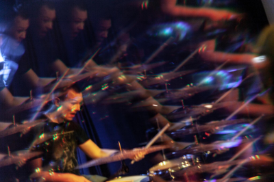

  

### Hi there 👋

I'm Marcel, 26, currently pursuing a bachelor's degree in Computer Science at the University of Applied Sciences Augsburg.
I like to code all kinds of stuff, especially if it's sports or music related and, of course, open source.

#### 👷 Check out what I'm currently working on

- [education/GitHubGraduation-2022](https://github.com/education/GitHubGraduation-2022)
- [mac641/audio-converter](https://github.com/mac641/audio-converter)
- [teamulster2/soTired](https://github.com/teamulster2/soTired)
- [teamulster2/report](https://github.com/teamulster2/report)

#### 🌱 My latest projects

- [mac641/audio-converter](https://github.com/mac641/audio-converter) - audio-converter allows you to convert audio files from within your web browser.
- [mac641/qnap-nas-backup](https://github.com/mac641/qnap-nas-backup) - This repo contains Docker components for backing up your QNAP NAS within a LAN.
- [mac641/tab-split-merger](https://github.com/mac641/tab-split-merger) - Tab Split Merger for Firefox splits tabs into multiple windows and merges them back together into one.

#### 📓 Gists I wrote

- [Install Alpine Linux on WSL and connect it to Docker Desktop](https://gist.github.com/07a53ba45f0b30af046d6f9ed94a1ace)
- [Installing Fedora CoreOS on VirtualBox on Windows 10](https://gist.github.com/7b4e24ad0dc0c2cac281ca6b8b48eb07)

#### 📫 How to reach me

Feel free to shoot me a message anytime! :)  
* LinkedIn: https://www.linkedin.com/in/mac641/
* Mastodon: https://mastodon.art/@mac641
